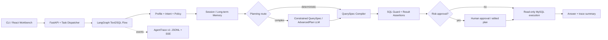

# Industrial Text2SQL Agent

面向工业数据分析的受控 Text2SQL Agent。项目以树脂基防热材料和钢铁能耗/碳排放两个领域为例，展示如何将自然语言查询转为经过 Profile、结构化计划、SQL Guard、结果校验、人工审批和可观测性约束的只读 SQL 执行。

它不是让模型直接执行自由 SQL 的 Demo。系统遵循“**LLM 提议，程序校验，人工审批**”的原则：确定性查询优先由编译器执行，复杂查询由模型生成受限 `QuerySpec` 或 `AdvancedPlan`，自由 SQL 仅是最后的受控兜底。

## Highlights

- **领域可配置**：通过 YAML Profile 描述表、粒度、主键、Join、术语别名、派生指标、时序语义和安全策略；当前支持材料与钢铁两个 MySQL Schema。
- **分层生成与修复**：确定性 QuerySpec 编译优先；复杂查询走受限结构化计划，校验失败后才进入有预算的模型修复与降级路由。
- **记忆与多轮对话**：短期会话状态支持“这些样本”“它”等指代；长期记忆区分语义、情景和程序性记忆，候选 few-shot 需经过独立验证和审批后才能提升。
- **安全与人工审批**：只读 SQL Guard、表/字段白名单、危险函数拦截、行数限制；高风险计划在执行前进入不可变审批快照，审批者只能修改结构化计划而不能直接改 SQL。
- **可观测性**：`AgentTrace v1` 为每个节点记录 Trace/Span、路由、模型角色、安全与审批决策、耗时和失败码；JSONL、SSE、任务存储使用同一 `trace_id`。
- **工程化评测**：当前 release benchmark 为材料 82 题、钢铁 Profile 62 题、钢铁高级分析 10 题；其中安全边界独立统计，总计 154 题。历史 80/60/10 结果保留在 legacy baseline，不与当前 release 混用。

## Architecture



## Evaluation Snapshot (historical comparison)

当前 release 基线：`eval/baselines/v5.2-normalized-production.json`。`可接受通过`允许不改变查询语义的额外投影；`严格通过`还要求返回列严格匹配。历史 few-shot 版本 `v5.2-production-fewshot` 仅用于版本对比。

| Domain / suite | Cases | Acceptable pass | Strict pass | Safety pass |
|---|---:|---:|---:|---:|
| Resin engineering benchmark (legacy) | 80 | 80/80 (100%) | 65/80 (81.3%) | 8/8 (100%) |
| Steel Profile benchmark (legacy) | 60 | 60/60 (100%) | 60/60 (100%) | 4/4 (100%) |
| Steel advanced Agent challenge (legacy) | 10 | 10/10 (100%) | 9/10 (90.0%) | N/A |

当前 release 的 154 题 normalized 结果以 `eval/harness_runs/<run-label>/metrics.json` 为准；完整对比与耗时见 [评测布局](eval/EVALUATION_LAYOUT_V2.md) 和 [few-shot 版本报告](eval/FEWSHOT_VERSION_COMPARISON.md)。

## Two Reproducible Cases

1. **材料跨时序分析**：`原始孔隙率小于0.35的样本中，平均背面温度最高的5个是哪些？`
   - Profile 连接静态属性表和时序响应表，执行静态过滤、按样本聚合与 Top-K 排序。
   - 运行：
     ```bash
     conda run -n scitime-agent python eval/run_evaluation.py \
       --suite eval/benchmark_v1.py --only cross_temporal_extra_001 \
       --run-id demo-resin-cross-temporal --memory-mode production
     ```

2. **钢铁高级计划与修复**：`计算每个月碳强度相较上个月的变化率，按增幅从高到低列出前3个月。`
   - Agent 生成受限窗口分析计划，编译为含 `LAG` 的 SQL；计划契约、白名单、结果断言和一次受控修复共同保障执行。
   - 运行：
     ```bash
     conda run -n scitime-agent python eval/run_evaluation.py \
       --suite eval/steel_agent_challenge_v1.py --only steel_agent_002 \
       --run-id demo-steel-window-change --memory-mode production
     ```

案例的预期路径、Trace 观察点和面试讲解提纲见 [Demo Cases](docs/DEMO_CASES.md)。

## Quick Start

### Prerequisites

- Python 3.10，建议 Conda 环境 `scitime-agent`
- MySQL，已导入材料与钢铁 Schema
- Ollama 或 OpenAI-compatible 模型服务；确定性和安全测试不依赖真实模型
- Node.js 20，仅在启动 React Workbench 时需要

安装依赖后，在项目根目录创建仅保存在本机的 `.env`，配置 LLM、材料数据库和任务队列相关变量。不要提交 `.env`、数据库密码或 API Key。

```bash
conda run -n scitime-agent pip install -r requirements.txt
conda run -n scitime-agent python check_setup.py
conda run -n scitime-agent python cli.py
```

启动浏览器工作台：

```bash
conda run --no-capture-output -n scitime-agent uvicorn app.api:app --reload --port 8000
cd web && npm ci && npm run dev
```

访问 `http://127.0.0.1:5173`；开发账户、任务队列和审批流程见 [Workbench](docs/AGENT_WORKBENCH.md) 与 [Multi-user Platform](docs/MULTI_USER_PLATFORM.md)。

## Quality Gates

```bash
# Fast, offline contract checks
conda run -n scitime-agent python -m unittest \
  tests.test_approval_workflow tests.test_api_workbench \
  tests.test_api_approval_e2e tests.test_evaluation_harness \
  tests.test_trace_contract -v

# Collect real evaluation output and compare it with the frozen baseline
conda run -n scitime-agent python -m eval.harness gate \
  --baseline eval/baselines/v5.2-production-fewshot.json \
  --candidate eval/harness_runs/<run-label>/metrics.json
```

GitHub PR CI runs compilation, backend/API/approval/Trace contracts and frontend build. The complete evaluation runs through [self-hosted regression CI](.github/workflows/full-regression.yml), because it requires the seeded database and local model services. Details: [Evaluation Harness](docs/EVALUATION_HARNESS.md) and [AgentTrace v1](docs/TRACE_OBSERVABILITY.md).

## Scope and Limits

- 当前 Profile 覆盖两个示例工业 Schema；接入新领域需要新增 Profile、同义词和评测样本，不应复制 Python 业务规则。
- 本地 3B 模型适合路由与受限结构化输出，但复杂计划仍可能进入 7B/API 修复路径；这是被明确记录的成本与可靠性权衡，不将其包装为完全自治。
- 系统只允许读取业务白名单表。生产部署仍应使用最小权限数据库账号、强 JWT 密钥、禁用演示账户，并设置 Trace 保留/脱敏策略。

## Repository Guide

| Path | Purpose |
|---|---|
| `app/` | LangGraph workflow, Profile runtime, Guard, approval, memory, API and Trace |
| `profiles/` | Resin and steel domain contracts |
| `eval/` | Frozen benchmarks, evaluator, Harness and baselines |
| `tests/` | Approval, API/SSE, Trace and evaluation contract tests |
| `web/` | React + Ant Design workbench |
| `docs/` | Workbench, memory/approval, observability and CI documentation |

## License

For research and portfolio use. Verify data licenses and remove all secrets before deployment.
